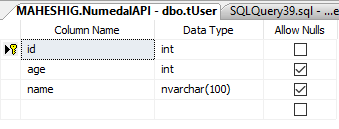
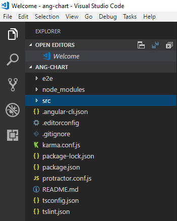

Here I am going to create an Angular chart by using the ASP.NET Web API with Dapper for the Data Access Layer, SQL Server for the database. The IDE used was Visual Studio 2017.

This is the table I am using for the web api



To create the Web API, please follow this link [here](https://medium.com/@maheshi.gunarathne1994/web-api-using-asp-net-core-2-0-and-entity-framework-core-with-mssql-59d30f33ff64).

Now lets start creating our Angular Project.

# Setting up the Environment

- Install the Angular CLI
- Create a new Application
- Serve the Application

Follow these steps to create your Angular project

1. Create a folder

```bash
mkdir chartAPI
```

2. Use this following commands to create and serve the Application.

```bash
cd chartAPI
npm install -g @angular/cli
ng new ang-chart
cd ang-chart
ng serve --open
```

Now we have successfully created our project.

> Open your project using any developer tool(Source code editor). Here I am using Visual Studio code.

Your project will display like this



# Implementation of Angular Charts

## Angular components

> Components are the fundamental building blocks of Angular applications. They display data on the screen, listen for user input, and take action based on that input.

### Create Component using Angular CLI

Create a folder “views” in `src/app/views`

Using the Angular CLI lets generate our new component home.

(This is the place we are doing the implementation of the graph.)

```bash
ng generate component home
```

## Routing

> An Angular best practice is to configure the router in a separate top level module which dedicates routing and import by the root AppModule.

#### app.routes.ts
```typescript
import { Routes, RouterModule } from '@angular/router';
import { HomeComponent } from './views/home/home.component';

const appRoutes: Routes = [

    {path: 'home',component: HomeComponent},   
    { path: '', redirectTo: '/home', pathMatch: 'full' },
   
];

export const AppRoutes = RouterModule.forRoot(appRoutes);
```

Add these lines in app.module.ts

```typescript
import { AppRoutes } from “./app.routes”;
imports: [AppRoutes],
```

Open the AppComponent template and replace the code with a

`<router-outlet>` element.

#### app.component.html

```html
<body>
    <h2>{{title}}</h2>
  <div id="wrapper">
      <main id="page-content-wrapper" role="main">
         <router-outlet></router-outlet>
      </main>
  </div> 
</body>
```

> Create a **User** class in its own file in the `src\app` folder with id,age,name properties.

```typescript
export class User
{
   id:number;
   age:number;
   name:string;

}
```

Components should not fetch data directly and they obviously should not knowingly display the non-real data.

They should focus on presenting data and delegate data access to a service because service is a great way to share the information among classes that don’t know each other.

So lets create our `UsersService` class in `src/app/services`

### users.service.ts
```typescript
import { Injectable } from '@angular/core';

@Injectable()
export class UsersService {

  constructor() { }

}
```

This project we have to add the data persistence features in order to get the help from `HttpClient`.

## HTTP Services

> HttpClient is angular mechanism we use for the communication with a remote server over HTTP.

Lets Enable HttpClient in our app as follows.

```typescript
import { HttpClientModule, HttpClient } from ‘@angular/common/http’;
```

Add the UsersService and HttpClientModule in the Provider array.

```typescript
providers: [UsersService,HttpClientModule],
```

Here I am using the ASP.NET CORE 2.0 Web API I have created to fetch data to the UsersService class.

```typescript
import { Injectable } from '@angular/core';
import { HttpClient } from '@angular/common/http';
import { User } from './../user';
import { Observable } from 'rxjs/Rx';

@Injectable()
export class UsersService {

  url = 'http://localhost:25277/api/User';

  constructor(private http: HttpClient) { }

  getUsers(): Observable<User[]> {
    return this.http.get<User[]>(this.url + '?_sort=id&_order=desc');
  }
}
```

## Angular ngx-charts

> ngx-charts is a [Swimlane](http://swimlane.com/) open-source project.

Here we are using **ngx-charts**.

install the **@swimlane/ngx-charts** to your app.

```bash
npm i @swimlane/ngx-charts --save
```

After install that package, you can see that inside your package.json file.

Now you have create a function to display the users as a bar chart by using the data you are getting from the API you have created.

You should use “name” and “value” keywords when displaying the X and Y values.

#### home.component.ts
```typescript
import { Component, OnInit } from '@angular/core';
import { UsersService } from "../../services/users.service"
import { id } from "@swimlane/ngx-charts/release/utils";
import { element } from "protractor";
import { Router, RouterModule, RouterLink } from '@angular/router';
import { Observable } from 'rxjs/Rx';
@Component({
  selector: 'app-home',
  templateUrl: './home.component.html',
  styleUrls: ['./home.component.css']
})
export class HomeComponent implements OnInit {
  UserList: any[] = [];
  done: boolean = false;
  view: any[] = [500, 300];

  // options
  showXAxis = true;
  showYAxis = true;
  gradient = false;
  showLegend = true;
  showXAxisLabel = true;
  xAxisLabel = 'name';
  showYAxisLabel = true;
  yAxisLabel = 'age';

  colorScheme = {
    domain: ['#444b8f', '#1288a4', '#02cc9c', '#aadb6a']
  };
  constructor(public users: UsersService) {

  }
  displayAllUsers(): void {

    this.users.getUsers().subscribe(users => {
      users.forEach(element => {
        this.UserList.push({ "name": element.name, "value": element.age });  // can take only x y values
      });
      this.done = true;
      console.log(this.UserList);
    })

  }
  ngOnInit() {

    this.displayAllUsers();
  }

}
```

#### home.component.html

```html
<div class="main-content"> 
  <div class="container">
      <div class="row">
       
        <div class="col-md-12">
          <div class="col-md-6" >
            <h2 style="margin-left: 30%;">User Display </h2>
            <ngx-charts-bar-vertical *ngIf="done"
    
            [view]="view"
            [scheme]="colorScheme"
            [results]="UserList"
            [legend]="showLegend"
            [gradient]="gradient"
            [xAxis]="showXAxis"
            [yAxis]="showYAxis"
            [showXAxisLabel]="showXAxisLabel"
            [showYAxisLabel]="showYAxisLabel"
            [xAxisLabel]="xAxisLabel"
            [yAxisLabel]="yAxisLabel"
          >
    
          </ngx-charts-bar-vertical>
         </div>
    
    </div>
        
      </div>
     
  </div>
</div>
```

Now use `ng serve` command and see you will get a graph like this.

Here are some helpful documentations you can follow.

- [Angular 2 charts](https://valor-software.com/ng2-charts/)
- [ngx-charts](https://github.com/swimlane/ngx-charts)

# Summary

Now we have created our Angular chart Application with ngx-charts using the data from ASP.NET CORE 2.0 Web API.

you can download the source code from [GitHub](https://github.com/maheshigunaratne/AngualrChartWithAPI).