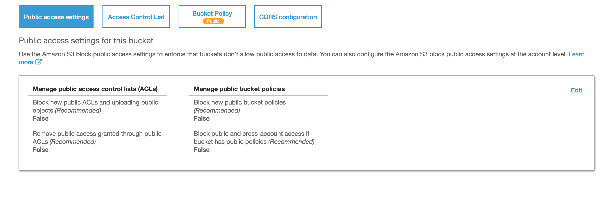

If you are looking for a suitable option rather than uploading images into `/public` folder in Laravel you have come to the right place. This solution will not only highly scalable but also increase you performance and saves your hosting space.

First I will explain configurations from AWS console side

## AWS Configuration

1. Goto AWS S3 page and create a S3 bucket
2. Click bucket name and got to Permissions and public access settings
3. Choose false for public access setting for your bucket

**NOTE:** In [conclusion](#conclusion) I discuss about how to make this bucket private and add more security to application. If you don't want a public bucket you can skip this.
4. Then paste this code into your Bucket policy to make your bucket public
**NOTE:** In [conclusion](#conclusion) I discuss about how to make this bucket private and add more security to application. If you don't want a public bucket you can skip this.
```json
{
    "Version": "2012-10-17",
    "Statement": [
        {
            "Sid": "AddPerm",
            "Effect": "Allow",
            "Principal": "*",
            "Action": "s3:GetObject",
            "Resource": "arn:aws:s3:::YOUR_BUCKET_NAME/*"
        }
    ]
}
```
5. You need to find your credentials in AWS account. refer [this article](https://aws.amazon.com/blogs/security/how-to-find-update-access-keys-password-mfa-aws-management-console/)

## Laravel Implementation

1. Change disks and S3 in `config/filesystems.php` file as follows

```php
<?php
 
return [
 
    .....
 
    'disks' => [
 
        .....
 
        's3' => [
            'driver' => 's3',
            'key' => env('AWS_ACCESS_KEY_ID'),
            'secret' => env('AWS_SECRET_ACCESS_KEY'),
            'region' => env('AWS_DEFAULT_REGION'),
            'bucket' => env('AWS_BUCKET'),
        ],
 
    ],
];
```

2. You should update your env file with these

```.env
AWS_ACCESS_KEY_ID=***
AWS_SECRET_ACCESS_KEY=***
AWS_DEFAULT_REGION=***
AWS_BUCKET=***
```

3. Install s3 file system dependency 

```bash
composer require league/flysystem-aws-s3-v3
```

4. Update your blade form as this

```HTML
<form action="{{ url('ACTION_URL') }}" method="post" enctype="multipart/form-data">
    <div class="form-group">
        <label for="exampleInputFile">File input</label>
        <input type="file" name="profile_image" id="exampleInputFile">
    </div>
    {{ csrf_field() }}
<button type="submit" class="btn btn-default">Submit</button>
```

5. Use Storage facade in controller

import Storage by

```php
use Illuminate\Support\Facades\Storage;
```

Then you code should be
```php
public function store(Request $request)
{
    if($request->hasFile('profile_image')) {
 
        //get filename with extension
        $fileNameWithExtension = $request->file('profile_image')->getClientOriginalName();
 
        //get filename without extension
        $filename = pathinfo($fileNameWithExtension, PATHINFO_FILENAME);
 
        //get file extension
        $extension = $request->file('profile_image')->getClientOriginalExtension();
 
        //filename to store
        $fileNameToStore = $filename.'_'.time().'.'.$extension;
 
        //Upload File to s3
        Storage::disk('s3')->put($fileNameToStore, fopen($request->file('profile_image'), 'r+'), 'public');
 
        //your code to store $fileNameToStore in the database
    }
}
```
**NOTE:** In conclusion I discuss about how to make this bucket private and add more security to application. If you don't want a S3 public bucket you can skip `public in code`.

here after you can use this to get url of upload file
```php
$url = Storage::disk('s3')->url('YOUR_FILENAME_HERE');
```

and this to delete a file
```php
Storage::disk('s3')->delete('YOUR_FILENAME_HERE');
```

# Conclusion

## Best Practices

1. Separate credentials from code.

in `config/filesystems.php` we can leave `key` and `secret` as blanks php-sdk will try to call instance profile 

```php
<?php
 
return [
 
    .....
 
    'disks' => [
 
        .....
 
        's3' => [
            'driver' => 's3',
            'key' => '',
            'secret' => '',
            'region' => env('AWS_DEFAULT_REGION'),
            'bucket' => env('AWS_BUCKET'),
        ],
 
    ],
];
```

**NOTE:** this will make a problem of switching .env variables and instance profile when goto prod from dev. I you know a workaround let us know.

2. Application stores only file name or relative file path. That makes developers' lives easier when migrate from one storage to another.

3. Make S3 Bucket private and `temporaryURL` for image fetch. As an example

```php
$url = Storage::temporaryUrl(
    'file1.jpg', now()->addMinutes(5)
);
```
In order to have a secured private S3 bucket you can skip step 3 and 4. Then change the 

```php
Storage::disk('s3')->put(
    $fileNameToStore, 
    fopen($request->file('profile_image'),
     'r+'),
    'public'
    );
```
line to

```php
Storage::disk('s3')->put(
    $fileNameToStore,
    fopen($request->file('profile_image'),
    'r+')
    );
```
in your Controller.

I hope you find this article useful. Let me know if you have any question. ❤️


