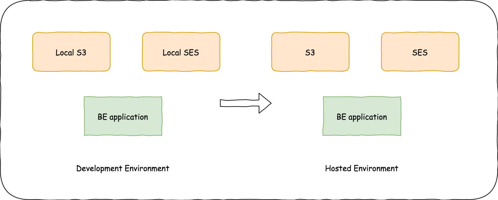

Have you ever come across an issue of using AWS resources in the development environment? I bet most of you have faced it. This issue might look much simpler and you might have used the existing AWS resource to carry on your local development. But, did you think about a way to solve this issue when testing happens on top of your framework or application?

Recently, when I was developing a node.js project I found an interesting platform named ([LocalStack](https://github.com/localstack/localstack)) which helped us to mimic AWS resources. This made our lives easier when not only testing our application but also application development.

Other than easy to test application, you can gain these benefits from Localstack,

1. No need to pay for AWS usage for your local development.
2. No need to log in to the AWS console.
3. Separate development ENV so everything under your control. (you can create and delete resources easily)
4. No sharing and getting problems from other developers since it's separated. ☺️
5. It’s full offline.


*Fig. 1: A diagram of the Localstack usage in test/dev environment*

So how would someone use Localstack with their application? 
Let's discuss this step by step.

There are multiple ways to start Localstack in your machine, but I would prefer the Docker included way because it’s more cleaner and easier than other ways. (This might depend on the docker knowledge you and your team possess)

Refer this link for other methods to start Localstack: https://github.com/localstack/localstack

The following example will be using node.js with Docker to build a backend. But please note that Localstack is not limited to node.js nor Docker technologies. However, If you are following the same stack I do, You won’t have to change much in your codebase.

1. Prepare your docker-compose file to cater the localstack
2. How to create resources locally
3. Code changes in node.js application

### Preparing your docker-compose file

```yml
version: "3"
services:
  app:
    image: node:alpine
    volumes:
      - ./:/app
    working_dir: /app
    depends_on:
      - mongo
    environment:
      NODE_ENV: development
      URL: mongo
      PORT: 27017
    ports:
      - 3001:3001
    links:
      - mongo:mongo
      - localstack:localstack
    command: npm run dev
  ...
  localstack:
    image: localstack/localstack:latest
    container_name: localstack_container
    ports:
      - '4563-4599:4563-4599'
      - '8055:8080'
    environment:
      - SERVICES=s3
      - DEBUG=1
      - DATA_DIR=/tmp/localstack/data
    volumes:
      - './.localstack:/tmp/localstack'
      - '/var/run/docker.sock:/var/run/docker.sock'
```

There are a few things you need to consider when writing the docker-compose file. 

1. You should include `localstack` as a link under your application. (please observe the example above)
2. I have provided `SERVICES=s3` as env variables under the localstack. That means this docker instance going to mimic functionality of an AWS S3.
3. Note that ports range I have enabled under localstack. `'4563-4599:4563-4599'` is for service mimic ports. `'8055:8080'` for localstack dashboard.

you can find more information here: https://github.com/localstack/localstack

Now that we have crafted the docker-composer, lets run our docker instances. use

```sh
docker-compose up -d
```

to run docker instances.

## Create resources locally

run 

```
aws --endpoint-url=http://localhost:4572 s3 mb s3://test-app-develop
aws --endpoint-url=http://localhost:4572 s3api put-bucket-acl --bucket test-app-develop --acl public-read
```

in your console.

This will create an S3 bucket named `test-app-develop` and bucket ACL (public-read) respectively.

## Code changes in node.js application

```js

// useLocal = is app running in development

config.s3 = {
  region: 'us-east-1',
  endpoint: useLocal ? 'http://localstack:4572' : undefined,
  credentials: useLocal
    ? {
        accessKeyId: '123',
        secretAccessKey: 'xyz'
      }
    : undefined,
  s3ForcePathStyle: true
};

const s3 = new AWS.S3(config.s3);
```

1. useLocal is a flag I used to determine running app env. This will help us to toggle S3 config depend on the env.
2. It is important to use `http://localstack:4572` as S3 endpoint. It is not `http://localhost:4572` because of Localstack running inside a Docker container.
3. You may find that I have added dummy credentials, That is because we cannot leave it empty. But You can be more creative and find an elegant way. (without dummy details in code)

## References

1. https://github.com/localstack/localstack
2. https://github.com/good-idea/localstack-demo
3. https://dev.to/goodidea/how-to-fake-aws-locally-with-localstack-27me