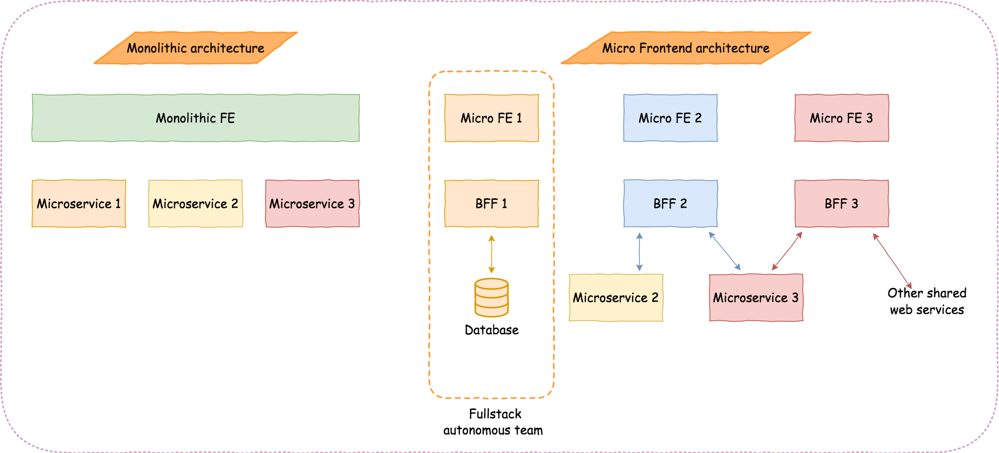

Implementing and maintaining a frontend is relatively harder than a backend project. It could get even worse if you have a huge frontend with different teams to develop different UI pieces. You might have seen teams trying to struggle with huge UIs to manage and their codebases with following various methods. Sometimes they rewrite their whole frontend architecture to solve this issue. However, there is an answer to the struggle, Micro Frontends.

The very first thing someone would ask is, when should we use micro frontend architecture. It could be listed as below,
- You have different teams to develop a huge application
- You need sperate deployments for separate applications’ UIs
- You need to use different UI frameworks for frontend

## Benefits of Micro FE Architecture

Adhering to Mirco-FE architecture would provide you various benefits. Among many, I would like to discuss the following,
- **Maintainable small code base** 

The frontend code base will be divided into smaller frontends which is more easier to maintain. In addition to that, the Decoupled codebase minimizes the ability to propagate a bug from code change to the whole application. (I would suggest to avoid or minimize the coupling between micro frontends. Coupling between micro frontends would make implementation and decision making harder for developers.)
- **Incremental upgrades** 

This smaller codebase would allow you to update or even rewrite your application in an incremental manner which you found almost impossible in a monolithic frontend. Hereafter, the development team can adapt to a new frontend technology even the starting point of the application was much older technology. Which you may upgrade in a later phase of the development cycle.
- **Independent deployments** 

Micro frontends can be deployed independently (Just as a typical microservice). This would give us more chances to minimize the scope of effect when a deployment happens to the frontend and even easy to debug or identify what went wrong after a deployment.
- **Autonomous teams** 

The decoupled codebase would allow development teams to develop and deploy independently. This is a huge plus point when you have several teams to develop one application.

## Challenges Encountered

However, there are a few challenges of using micro frontends architecture,

- **Initial application payload size** 

Since every micro application is going to duplicate dependencies and several code lines, the initial app load time size for an application would be higher. The overall application size would be larger than a monolithic application. (It is obvious since every micro app would contain duplicated dependencies n times)
- **Difficulty to local development**

 Since micro frontends cannot initialize without the container application local development needs both applications to run simultaneously. In addition to that, the codebase of a micro application is slightly different than a usual application thus, developers need to code changes to start a micro application independently. (Even though an application could work separately, depends on the framework or the technology used for micro frontend implementation, developers need to do few code changes to start application separately in local)
- **Operational and governance complexity** 

It is obvious since we divided the monolithic repository into smaller repositories the development team needs more testing, more pipelines, and resources to operate the application.
- **Shared data/communication between applications** 

 In an ideal scenario a micro frontend should act independently, But practically we found many cases where we required to communicate back and forth between micro applications. (such as shared data about the authentication/token details, a variable that should update and effect to every micro frontend, etc.). Even though we expect micro applications to develop independently at one point we might need to share some details between applications. (We can discuss this in a later article to deep dive in these challenges of micro frontend architecture)

## Implementation methods

During my research to implement micro frontends, I could found several approaches that we might call it a micro frontend approach.

### Client-Side
- **Web Components** - Web components are a concept of creating custom dom elements. They are like widgets that can be imported into the application.
- **Javascript integration** - Frameworks like Single-SPA will help you to implement micro frontends using a javascript library.
- **iFrame** - You can use iframes to inject an application. This is not a recommended approach.

### Server-Side
- **Zalandos solution** - https://www.mosaic9.org/
- **Facebook’s big pipe** - https://www.facebook.com/notes/facebook-engineering/bigpipe-pipelining-web-pages-for-high-performance/389414033919/

Apart from all the examples given above you could custom tailor a solution for your need as you please. However, we chose Single-SPA for our requirement since we were working with serverless applications and the minimum learning curve.

### Overall architecture

Adhering to micro frontend architecture doesn’t limit you from using standard frontend backend architecture. However, We have seen that using a BFF(Backend for Frontend) would help teams in several ways. Such as,

- Communication between several API should happen in a separate layer rather than the service layer. I believe backend microservice should be decoupled and communication between other services should happen through the BFF layer. This approach allows us to use a separate BFF for every single micro frontend which is easier to manage with our autonomous team.
- A BFF is actually another layer of security - When it comes to our project, We place our backend services inside a VPN. Thus, BFF is the only endpoint exposed to the public and those endpoints are well protected using authentication and Web firewalls.

*Fig. 1: A highlevel comparison between monolithic frontend and micro frontend architecture*

The next architectural decision is to where should we handle the authentication. Authentication was a real challenge when we were developing the container(main application) in our architecture. The solution was the main container should have authentication forms and auth functions. When a session is authenticated the main application should be able to inject those details into all micro frontends. (Let’s discuss these challenges in another article for micro frontends)

## Conclusion

An application frontend was the final bottleneck for the dream of autonomous and independent teams. For many years developers were struggling to develop a larger frontend without proper decoupling and cohesion. I believe this trend will help them to solve not only the issues I mentioned but also frontend engineering will be considered a serious task in the future. 

## References:
- https://martinfowler.com/articles/micro-frontends.html
- https://medium.com/@tomsoderlund/micro-frontends-a-microservice-approach-to-front-end-web-development-f325ebdadc16
- https://medium.com/@lucamezzalira/i-dont-understand-micro-frontends-88f7304799a9
- https://www.infoq.com/news/2020/01/strategies-micro-frontends/
- https://levelup.gitconnected.com/brief-introduction-to-micro-frontends-architecture-ec928c587727