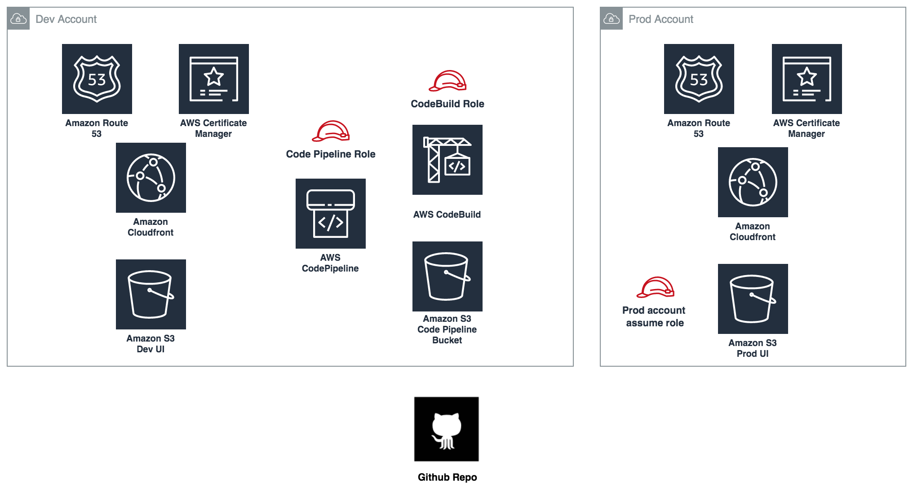
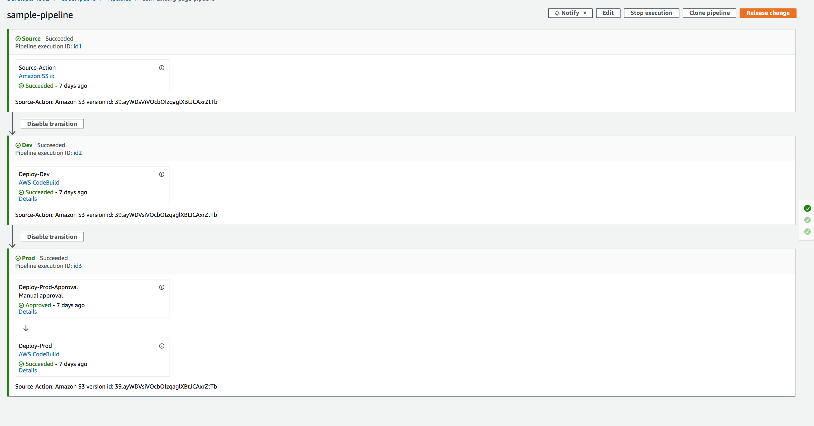

# Introduction
Recently I had an opportunity to design and implement end to end deployment pipeline of a Gatsby project.
I believe most you have heard about Gatsby.js which is a javascript framework to create blazing fast static websites. In this article, I am not going to explain about Gatsby.js.That is because every frontend framework is almost equal when it comes to deployment. Hence, I will explain how I deployed this static website into AWS S3 and Amazon Cloudfront using the AWS code pipeline.

# Architecture



The frontend UI code will be stored in a private AWS S3 bucket. Then I am going to use a Cloudfront to distribute the hosted code in all edge locations around the globe. You can see ACM (Amazon Certificate Manager) and Route 53 which was used to provide SSL certificate and DNS management respectively. The very same architecture is used inside the Prod account as well. As you can see, we all can agree that this is a very simple architecture.

# Deployment

## Pipeline Flow

I will start the code pipeline flow from the inception.

1. The pipeline will be triggered by a code change in the Github repository. (In my scenario repository is an inhouse repository. Hence, I used this method to trigger the code pipeline: https://aws.amazon.com/blogs/devops/integrating-git-with-aws-codepipeline/)
2. Then the pipeline will automatically start the code build. The code build has the instructions to build the source code and deploy it into the dev S3 bucket.
3. After the deployment, the pipeline will be on hold till we confirm to go ahead. This is achieved by using an approval step in the code pipeline.
4. The final step is when we approve the manual approval. This will build the code again (This is a limitation with JS. If we have separate env variable we need to build the code again) and push it to the prod account S3 bucket.

## Cloudformation Template

You can run this CFT from the AWS console. This cloudformation template is self-explanatory. However, I commented on some points that I thought worthy to mention.

<details>
<summary>Expand to see the CFT code</summary>

```yaml
AWSTemplateFormatVersion: 2010-09-09
Description: Cloudformation template for code pipeline

Parameters:
  # Tagging Params
  ApplicationName:
    Description: Name of application
    Type: String
    MinLength: "1"
    MaxLength: "255"
    AllowedPattern: '[\x20-\x7E]*'
    ConstraintDescription: Must contain only ASCII characters.
  #stack params
  SourceBucketName:
    Description: git source
    Default: git-web-hook-outputbucket
    Type: String
  DevDistributionID:
    Description: Dev Cloudfront Distribution ID
    Type: String
  ProdDistributionID:
    Description: Prod Cloudfront Distribution ID
    Type: String
  DevDeployBucket:
    Description: Deploy Bucket ARN
    Type: String
  DevDeployBucketName:
    Description: Deploy Bucket Name
    Type: String
  ProdDeployBucket:
    Description: Deploy Bucket ARN
    Type: String
  ProdDeployBucketName:
    Description: Deploy Bucket Name
    Type: String
  CodePipelineBucketPrefix:
    Description: CodePipeline needs a utility bucket for its internal use. Specify a unique prefix for the bucket name
    Type: String
  # assume role arn
  AssumeRoleArn: 
    Description: Prod Assume Role ARN
    Type: String

Resources:
  Pipeline:
    Type: "AWS::CodePipeline::Pipeline"
    Properties:
      Name: gatsby-site-pipeline
      RoleArn: !GetAtt CodePipelineRole.Arn
      ArtifactStore:
        Location: !Ref PipelineBucket
        Type: S3
      Stages:
        - Name: Source
          Actions:
            - Name: Source-Action
              ActionTypeId:
                Category: Source
                Owner: AWS
                Version: 1
                Provider: S3
              OutputArtifacts:
                - Name: gatsby-site-source-artifact
              Configuration:
                S3Bucket: !Ref SourceBucketName
                S3ObjectKey: repo-name-develop.zip # <repo-name>-<branch-name>
                PollForSourceChanges: true
              RunOrder: 1
        - Name: Dev
          Actions:
            - Name: Deploy-Dev
              ActionTypeId:
                Category: Build
                Owner: AWS
                Version: 1
                Provider: CodeBuild
              InputArtifacts:
                - Name: gatsby-site-source-artifact
              OutputArtifacts:
                - Name: gatsby-site-dev-build-artifact
              Configuration:
                ProjectName: !Ref DevCodeBuild
              RunOrder: 1
        - Name: Prod
          Actions:
            - Name: Deploy-Prod-Approval
              ActionTypeId:
                Category: Approval
                Owner: AWS
                Provider: Manual
                Version: "1"
              RunOrder: 1
            - Name: Deploy-Prod
              ActionTypeId:
                Category: Build
                Owner: AWS
                Version: 1
                Provider: CodeBuild
              InputArtifacts:
                - Name: gatsby-site-source-artifact
              OutputArtifacts:
                - Name: gatsby-site-prod-build-artifact
              Configuration:
                ProjectName: !Ref ProdCodeBuild
              RunOrder: 2
  CodeBuildRole:
    Type: AWS::IAM::Role
    Properties:
      RoleName:
        "Fn::Join": ["", ["CodeBuildRole", "-", !Ref "AWS::StackName"]]
      AssumeRolePolicyDocument:
        Version: "2012-10-17"
        Statement:
          - Effect: Allow
            Principal:
              Service:
                - "codebuild.amazonaws.com"
            Action:
              - "sts:AssumeRole"
      Path: /service-role/
      Policies:
        - PolicyName: root
          PolicyDocument:
            Version: "2012-10-17"
            Statement:
              - Effect: Allow
                Action:
                  - "s3:GetObject"
                  - "s3:GetObjectVersion"
                  - "s3:GetBucketVersioning"
                  - "s3:PutObject"
                Resource:
                  - !GetAtt PipelineBucket.Arn
                  - !Join ["", [!GetAtt PipelineBucket.Arn, "/*"]]
              - Effect: Allow
                Action:
                  - "s3:ListAllMyBuckets"
                  - "s3:ListBucket"
                  - "s3:HeadBucket"
                  - "s3:GetObject"
                  - "s3:GetObjectVersion"
                  - "s3:GetBucketVersioning"
                  - "s3:PutObject"
                  - "s3:PutObjectAcl"
                  - "s3:DeleteObject"
                Resource:
                  - !Ref DevDeployBucket
                  - !Join ["", [!Ref DevDeployBucket, "/*"]]
              - Effect: Allow
                Action:
                  - ec2:DescribeSecurityGroups
                  - ec2:DescribeNetworkInterfaces
                  - ec2:DescribeSubnets
                  - ec2:DescribeVpcs
                  - ec2:DescribeDhcpOptions
                  - ec2:CreateNetworkInterfacePermission
                  - ec2:CreateNetworkInterface
                  - ec2:DeleteNetworkInterfacePermission
                  - ec2:DeleteNetworkInterface
                  - logs:CreateLogGroup
                  - logs:CreateLogStream
                  - logs:PutLogEvents
                  - cloudfront:CreateInvalidation
                Resource:
                  - "*"
  ProdCodeBuildRole:
    Type: AWS::IAM::Role
    Properties:
      RoleName:
        "Fn::Join": ["", ["CodeBuildRole-Prod", "-", !Ref "AWS::StackName"]]
      AssumeRolePolicyDocument:
        Version: "2012-10-17"
        Statement:
          - Effect: Allow
            Principal:
              Service:
                - "codebuild.amazonaws.com"
            Action:
              - "sts:AssumeRole"
      Path: /service-role/
      Policies:
        - PolicyName: root
          PolicyDocument:
            Version: "2012-10-17"
            Statement:
              - Effect: Allow
                Action:
                  - "s3:GetObject"
                  - "s3:GetObjectVersion"
                  - "s3:GetBucketVersioning"
                  - "s3:PutObject"
                Resource:
                  - !GetAtt PipelineBucket.Arn
                  - !Join ["", [!GetAtt PipelineBucket.Arn, "/*"]]
              - Effect: Allow
                Action:
                  - ec2:DescribeSecurityGroups
                  - ec2:DescribeNetworkInterfaces
                  - ec2:DescribeSubnets
                  - ec2:DescribeVpcs
                  - ec2:DescribeDhcpOptions
                  - ec2:CreateNetworkInterfacePermission
                  - ec2:CreateNetworkInterface
                  - ec2:DeleteNetworkInterfacePermission
                  - ec2:DeleteNetworkInterface
                  - logs:CreateLogGroup
                  - logs:CreateLogStream
                  - logs:PutLogEvents
                Resource:
                  - "*"
              - Effect: Allow
                Action:
                  - sts:AssumeRole
                Resource: !Ref AssumeRoleArn
  CodePipelineRole:
    Type: AWS::IAM::Role
    Properties:
      RoleName:
        "Fn::Join": ["", ["CodePipelineRole", "-", !Ref "AWS::StackName"]]
      AssumeRolePolicyDocument:
        Version: "2012-10-17"
        Statement:
          - Effect: Allow
            Principal:
              Service:
                - "codepipeline.amazonaws.com"
            Action:
              - "sts:AssumeRole"
      Policies:
        - PolicyName: root
          PolicyDocument:
            Version: "2012-10-17"
            Statement:
              - Effect: Allow
                Action:
                  - "s3:GetObject"
                  - "s3:GetObjectVersion"
                  - "s3:GetBucketVersioning"
                  - "s3:PutObject"
                Resource:
                  - !GetAtt PipelineBucket.Arn
                  - !Join ["", [!GetAtt PipelineBucket.Arn, "/*"]]
                  - Fn::Sub: "arn:aws:s3:::${SourceBucketName}*"
                  - Fn::Sub: "arn:aws:s3:::${SourceBucketName}/*"
              - Effect: Allow
                Action:
                  - "codebuild:BatchGetBuilds"
                  - "codebuild:StartBuild"
                Resource: "*"
  DevCodeBuild:
    Type: "AWS::CodeBuild::Project"
    Properties:
      Name: !Sub ${AWS::StackName}-dev-build
      Description: gatsby site build
      ServiceRole: !GetAtt CodeBuildRole.Arn
      Artifacts:
        Type: CODEPIPELINE
      Environment:
        ComputeType: BUILD_GENERAL1_SMALL
        Type: LINUX_CONTAINER
        Image: "aws/codebuild/amazonlinux2-x86_64-standard:2.0"
        EnvironmentVariables:
          - Name: DISTRIBUTION_ID
            Value: !Ref DevDistributionID
          - Name: DEPLOY_BUCKET_NAME
            Value: !Ref DevDeployBucketName
      Source:
        Type: CODEPIPELINE
        BuildSpec: "buildspec-dev.yaml"
      Tags:
        - Key: Technical:ApplicationName
          Value: !Ref ApplicationName

  ProdCodeBuild:
    Type: "AWS::CodeBuild::Project"
    Properties:
      Name: !Sub ${AWS::StackName}-prod-build
      Description: gatsby site build
      ServiceRole: !GetAtt ProdCodeBuildRole.Arn
      Artifacts:
        Type: CODEPIPELINE
      Environment:
        ComputeType: BUILD_GENERAL1_SMALL
        Type: LINUX_CONTAINER
        Image: "aws/codebuild/amazonlinux2-x86_64-standard:2.0"
        EnvironmentVariables:
          - Name: DISTRIBUTION_ID
            Value: !Ref ProdDistributionID
          - Name: DEPLOY_BUCKET_NAME
            Value: !Ref ProdDeployBucketName
          - Name: PROD_ROLE_ARN
            Value: !Ref AssumeRoleArn
      Source:
        Type: CODEPIPELINE
        BuildSpec: "buildspec-prod.yaml"
      Tags:
        - Key: Technical:ApplicationName
          Value: !Ref ApplicationName

  PipelineBucket:
    Type: "AWS::S3::Bucket"
    Properties:
      BucketName:
        !Join ["", [!Ref CodePipelineBucketPrefix, "-", !Ref "AWS::Region"]]
      Tags:
        - Key: Name
          Value: !Sub ${CodePipelineBucketPrefix}-pipeline
        - Key: Technical:ApplicationName
          Value: !Ref ApplicationName

Outputs:
  Pipeline:
    Value: !Ref Pipeline
  DevCodeBuild:
    Value: !Ref DevCodeBuild
  CodeBuildRole:
    Value: !Ref CodeBuildRole
  CodePipelineRole:
    Value: !Ref CodePipelineRole
  PipelineBucket:
    Value: !Ref PipelineBucket
```
</details>

## Build spec files

Build spec files provide instructions to the code build (how to build and deploy etc.).

### buildspec-dev.yml

```yaml
version: 0.2
phases:
  install:
    runtime-versions:
        nodejs: 12
  pre_build:
    commands:
      - echo Installing source NPM dependencies...
      - node -v
      - npm -v
      - npm install
  build:
    commands:
      - echo Dev Build started on `date`
      - npm run build
  post_build:
    commands:
      - aws s3 rm --recursive s3://${DEPLOY_BUCKET_NAME}
      - cd public && aws s3 sync . s3://${DEPLOY_BUCKET_NAME}
      - aws cloudfront create-invalidation --distribution-id ${DISTRIBUTION_ID} --paths "/*"
artifacts:
  files:
    - '**/*'
  base-directory: public
```

### buildspec-prod.yml

```yaml
version: 0.2
phases:
  install:
    runtime-versions:
        nodejs: 12
  pre_build:
    commands:
      - echo Installing source NPM dependencies...
      - node -v
      - npm -v
      - npm install
  build:
    commands:
      - echo Prod Build started on `date`
      - npm run build
      - chmod +x ./scripts/assume-role.sh
      - ./scripts/assume-role.sh ${PROD_ROLE_ARN} prod
  post_build:
    commands:
      - aws s3 rm --recursive s3://${DEPLOY_BUCKET_NAME} --profile prod
      - cd public
      - aws s3 sync . s3://${DEPLOY_BUCKET_NAME} --profile prod
      - aws cloudfront create-invalidation --profile prod --distribution-id ${DISTRIBUTION_ID} --paths "/*"
artifacts:
  files:
    - '**/*'
  base-directory: public
```

## Script to deploy in prod account

Insert this script inside a /script folder from your root folder.

```bash
#!/bin/bash
ROLE_ARN=$1
OUTPUT_PROFILE=$2

echo "Assuming role $ROLE_ARN"
sts=$(aws sts assume-role \
  --role-arn "$ROLE_ARN" \
  --role-session-name "$OUTPUT_PROFILE" \
  --query 'Credentials.[AccessKeyId,SecretAccessKey,SessionToken]' \
  --output text)
echo "Converting sts to array"
sts=($sts)
echo "AWS_ACCESS_KEY_ID is ${sts[0]}"
aws configure set aws_access_key_id ${sts[0]} --profile $OUTPUT_PROFILE
aws configure set aws_secret_access_key ${sts[1]} --profile $OUTPUT_PROFILE
aws configure set aws_session_token ${sts[2]} --profile $OUTPUT_PROFILE
echo "credentials stored in the profile named $OUTPUT_PROFILE"
```

This script will assume the role from the prod account and deploy changes into the prod account.


## Manually create Assume role in the Prod account

Next, we should manually create a role. When you create the role add this as an inline policy.

```json

    "Version": "2012-10-17",
    "Statement": [
        {
            "Action": [
                "s3:ListAllMyBuckets",
                "s3:ListBucket",
                "s3:HeadBucket",
                "s3:GetObject",
                "s3:GetObjectVersion",
                "s3:GetBucketVersioning",
                "s3:PutObject",
                "s3:PutObjectAcl",
                "s3:ListObjectsV2",
                "s3:DeleteObject"
            ],
            "Resource": [
                "arn:aws:s3:::<prod-bucket-name>",
                "arn:aws:s3:::<prod-bucket-name>/*",
            ],
            "Effect": "Allow"
        },
        {
            "Action": [
                "logs:CreateLogGroup",
                "logs:CreateLogStream",
                "logs:PutLogEvents",
                "cloudfront:CreateInvalidation"
            ],
            "Resource": [
                "*"
            ],
            "Effect": "Allow"
        }
    ]
}
```
Then under trust relationships add this JSON to enable assume your role from dev account.

```json
{
  "Version": "2012-10-17",
  "Statement": [
    {
      "Effect": "Allow",
      "Principal": {
        "AWS": "arn:aws:iam::<dev account>:root"
      },
      "Action": "sts:AssumeRole",
      "Condition": {}
    }
  ]
}   
```

Now everything is set to test. Try to trigger the pipeline by a code merge to see the magic happens. You pipeline should be something like this in your AWS console.



# Conclusion

1. I have added separate build steps in both codebuilds. If you don’t need two sperate builds you can use one instead.
2. IAM roles can be more optimized to provide least privileges.
3. This pipeline is suitable for ideally any kind of JS frontend deployment. (Of course, You need to change the buildspec steps.)


# References

1. [integrating-git-with-aws-codepipeline](https://aws.amazon.com/blogs/devops/integrating-git-with-aws-codepipeline/)